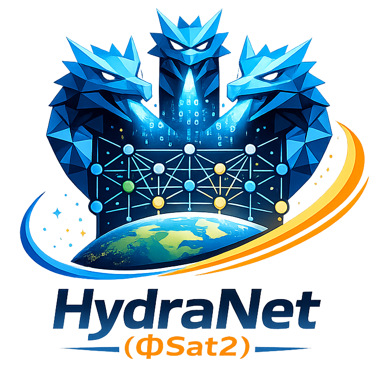

# HydraNet

Python package for loading models.

<p align="center">
    
</p>

## Installation

```
uv sync
```

Or install in editable mode:

```
pip install -e .
```

If you prefer not to install, run with `PYTHONPATH=src`.

## Loading Models

### Student (default: Myriad optimized) - Namely the `HydraNet`, which is the default when calling `load_student()` without arguments.

```python
from hydranet import load_student, available_student_presets

model = load_student()  # uses "myriad_optimized" by default
print(available_student_presets())

custom = load_student(
    preset="myriad_optimized",
    n_classes=4,  # overrides allowed
)
```

### Teacher (downstream) - Namely the `PhiSatNet`, which is the default when calling `load_teacher()` without arguments.

```python
from hydranet import load_teacher

teacher = load_teacher(
    task="segmentation",
    pretrained_path=None,
    input_dim=8,
    output_dim=3,
    depths=[2, 2, 6, 2],
    dims=[64, 128, 256, 512],
    img_size=224,
)
```

## Quick Start with Pre-trained Weights

Load pre-trained models from HuggingFace and split them into components (see [notebooks/start_here.ipynb](notebooks/start_here.ipynb)):

```python
import hydranet

# Load model with automatic weight download from HuggingFace
model = hydranet.load_student(
    preset='checkpoint',      # Matches HF checkpoint architecture
    task='burned_area',
    n_shots=5000,
    training='linear_probing',
    auto_load_weights=True,
    weights_dir='../weights',
    strict=False             # Allows task-specific head mismatches
)

# Split the model into ENCODER, BOTTLENECK, and DECODER components
components = hydranet.split_model(model)

# Access individual components
encoder = components.encoder
bottleneck = components.bottleneck
decoder = components.decoder

print(components)  # Display component summary
```

**Available:** 139 pre-trained model configurations from `sirbastiano/hydranet-phisat2` on HuggingFace.

## Student MoE and `phidranet`

This repository also includes a routerset-backed student Mixture-of-Experts path that assembles:

- one shared student encoder
- one learned routing switcher
- task-specific student decoder experts

The default expert set is aligned to routerset:

- `anomaly_detection`
- `burned_area`
- `fire`
- `lc`
- `roads`
- `worldfloods`

Recommended workflow:

```bash
export MICROMAMBA=/shared/home/rdelprete/bin/micromamba
export MAMBA_ROOT_PREFIX=/tmp/micromamba-hydranet-root
export MICROMAMBA_PREFIX=/tmp/hydranet-phisat2-mamba

make routerset-download MICROMAMBA_PREFIX=$MICROMAMBA_PREFIX
make clean-cache MICROMAMBA_PREFIX=$MICROMAMBA_PREFIX
make train-prepare MICROMAMBA_PREFIX=$MICROMAMBA_PREFIX
make smoketest-preflight MICROMAMBA_PREFIX=$MICROMAMBA_PREFIX
```

The canonical dataset root is `routerset/multilabel_dataset/`. The routerset training contract is fixed to `8x256x256`. Large `anomaly_detection` inputs are expanded into deterministic `256x256` tiles, and non-tiled samples are never resized: tensors larger than `256` are cut out deterministically and tensors smaller than `256` are zero-padded after channel normalization. The preflight step now fails if any selected expert has zero positive samples in either the train or validation split, which means routerset must be rebuilt before a canonical six-expert run if a task is missing positives.

The `--prepare-only` path is now the canonical training-readiness step. It configures a local runtime/cache root, writes `runtime_environment.json`, prefetches the six expert checkpoints into a local weights directory, runs the dataset/checkpoint preflight, and executes a startup gate that loads one routerset sample and probes Lightning import before any fit starts.

For the canonical one-shot full-training path, use:

```bash
make full-train MICROMAMBA_PREFIX=$MICROMAMBA_PREFIX RELEASE_NAME=v1 TRAIN_OUTPUT_DIR=outputs/moe/train_v1
```

This runs preflight, startup gate, full training/export, and post-export smoke validation in one invocation. A successful run updates `summary.json` to mark the `smoke` stage complete and writes `smoke_test_summary.json` plus `inference/` validation artifacts under the same output directory.

Then run training and final release creation:

```bash
PYTHONPATH=src $MICROMAMBA run -p "$MICROMAMBA_PREFIX" python scripts/train_moe_switcher.py \
  --routerset-dir routerset \
  --manifest-path routerset/multilabel_dataset/manifest_moe_train.jsonl \
  --runtime-root /tmp/hydranet-runtime \
  --output-dir outputs/moe/train_v1 \
  --release-name v1 \
  --training finetuning \
  --n-shots 5000 \
  --batch-size 4 \
  --max-epochs 20 \
  --learning-rate 1e-3 \
  --weight-decay 1e-4 \
  --target-size 256 \
  --target-channels 8 \
  --threshold 0.5 \
  --accelerator cpu \
  --devices 1
```

For a fast functional smoke test of the full MoE path, use:

```bash
PYTHONPATH=src $MICROMAMBA run -p "$MICROMAMBA_PREFIX" python scripts/smoke_test_moe.py \
  --routerset-dir routerset \
  --release-name smoke_v1 \
  --runtime-root /tmp/hydranet-runtime
```

This smoke run rebuilds the routerset split if needed, runs preflight, trains for one epoch, reloads the exported bundle, and writes an inference report under the smoke output directory.

If Lightning startup fails in the local environment, training now writes `startup_log.txt`, `startup_stage.json`, and a failed `summary.json` before exiting.

This creates:

- run artifacts under `outputs/moe/<timestamp>/`
- a final release package under `outputs/phidranet/phidranet_v1/`

The final bundle can be reloaded with:

```python
from hydranet import load_student_moe_bundle

model = load_student_moe_bundle("outputs/phidranet/phidranet_v1/student_moe_bundle.pt")
```

More detail is in `moe_works_report.md`.

## Finding the Myriad-Optimized Model

The `myriad_optimized` preset was selected through systematic architecture search (see [notebooks/FindHydraNet.ipynb](notebooks/FindHydraNet.ipynb)):

1. **Search Space**: Evaluated 100+ configurations varying:
   - Base filters: 8, 16, 32
   - Channel multipliers: [1,2,3], [1,2,3,4], etc.
   - Depth: 2, 3, 4 blocks
   - Patch sizes: 28×28 to 224×224

2. **Optimization Criteria**:
   - Total inference time across 4096×4096 tile
   - Parameter count vs accuracy trade-off
   - Hardware constraints (Myriad X VPU)

3. **Result**: 16 base filters, [1,2,3,4] multipliers, depth=3
   - ~60K parameters
   - Optimal latency/accuracy balance
   - Fits Myriad X memory and compute budget

The analysis used 3D visualization (parameters × depth × latency) to identify the Pareto-optimal configuration.

## Repo Layout

- `src/hydranet/`: package entrypoint and public loading helpers
- `src/hydranet/models/`: student + teacher model implementations
- `scripts/export_onnx.py`: ONNX export script (writes to `outputs/onnx/`)
- `examples/`: quick usage snippets
- `notebooks/`: interactive tutorials and model selection analysis
