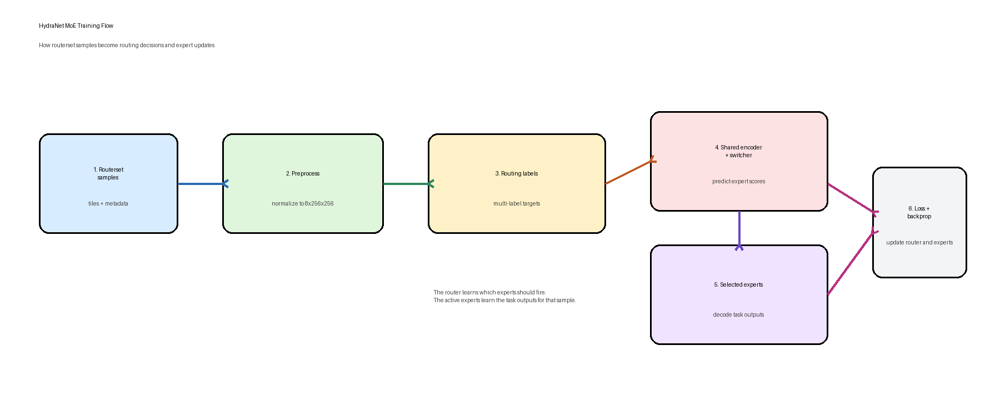

# HydraNet MoE Model

This document explains the HydraNet student Mixture-of-Experts model in plain language.

## Quick Summary

The model has three main parts:

1. A shared encoder reads the satellite image once and turns it into compact features.
2. A routing switcher looks at those features and predicts which expert tasks are relevant.
3. Task-specific expert decoders produce the final task outputs, such as fire or roads.

That means the model shares the expensive feature extractor, but keeps separate specialists for each downstream task.

## Topology

Editable Figma diagram:

- Topology: https://www.figma.com/online-whiteboard/create-diagram/c89a76e4-c1a6-49ef-831d-c1b283071c20?utm_source=chatgpt&utm_content=edit_in_figjam&oai_id=&request_id=4433acc0-14e8-42f6-b7c8-cbb46196b655

## How It Works

1. The input is an 8-channel satellite image.
2. The shared encoder extracts a common feature representation.
3. The switcher predicts a score for each expert.
4. The model keeps the top-k experts with the strongest routing scores.
5. Those experts decode the shared features into task-specific outputs.

In practice, this means one sample can activate different experts depending on what the image contains.

## Training Flow

Editable Figma diagram:

- Training flow: https://www.figma.com/online-whiteboard/create-diagram/fedddbbb-1fb3-4c8c-86a9-c08687ff8cbf?utm_source=chatgpt&utm_content=edit_in_figjam&oai_id=&request_id=ca74116c-dc05-41ee-9d29-776b244b0264

Training uses routerset samples and multi-label routing targets:

1. Routerset samples are normalized and tiled into the fixed `8x256x256` training shape.
2. Each sample gets a multi-label routing target that says which experts should be active.
3. The switcher predicts routing logits from the encoder bottleneck.
4. A BCE loss compares predicted expert activations against the routing target.
5. During the current training setup, the encoder and expert decoders stay frozen while the switcher is trained.

## Why This Design Exists

This topology is useful because:

- it avoids running a separate full model for every task
- it keeps a shared visual backbone across tasks
- it still allows task specialization through expert decoders
- it makes routing explicit, so you can inspect which experts were selected

## Code Pointers

- Model assembly: `src/hydranet/models/moe_student.py`
- Training wrapper: `src/hydranet/moe_lightning.py`
- End-to-end training entrypoint: `scripts/full_train_moe.py`
- Train-only switcher entrypoint: `scripts/train_moe_switcher.py`
